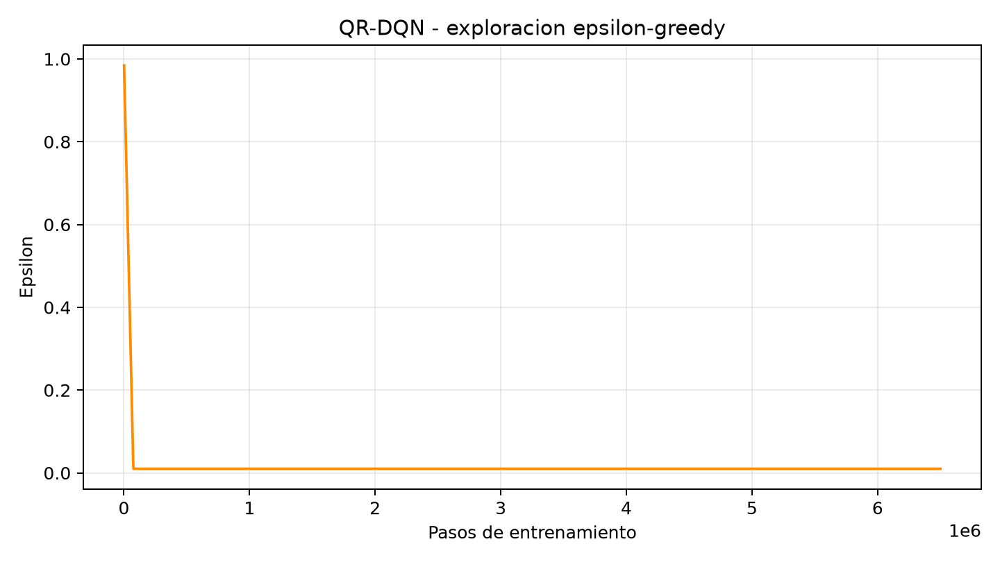
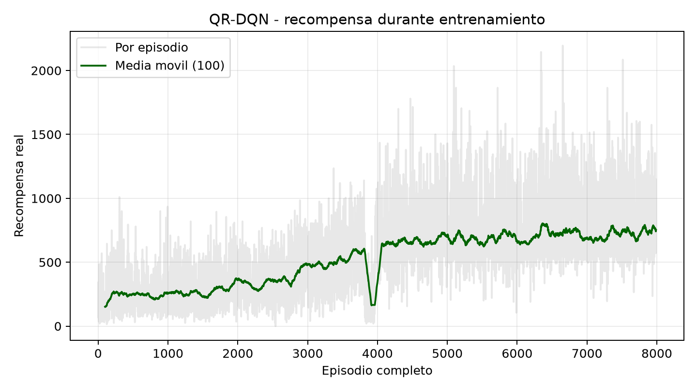
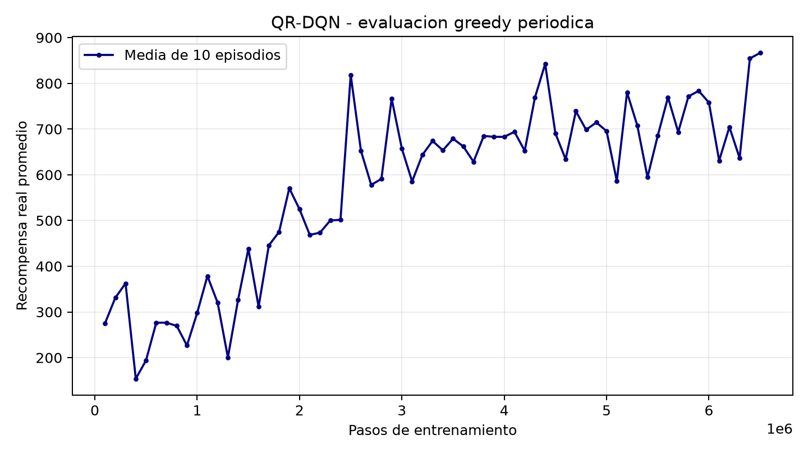
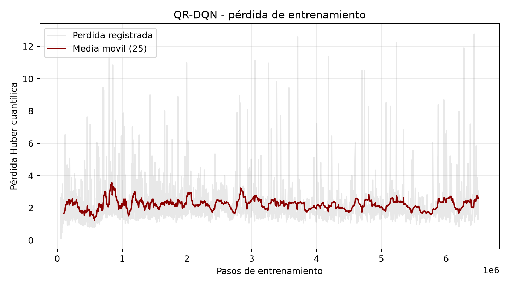

# CC3092 — Deep Learning y Sistemas Inteligentes

## Proyecto 2: Agente competitivo para Space Invaders

**Nombre:** Sebastian Garcia  
**Carné:** 22291  
**Fecha:** 25 de septiembre de 2026  

**Entorno:** `ALE/SpaceInvaders-v5`  
**Algoritmo final:** Quantile Regression Deep Q-Network (QR-DQN)  
**Implementación:** Gymnasium, ALE, Stable-Baselines3 y SB3-Contrib  
**Pasos acumulados de entrenamiento:** 6,500,000

---

## 2. Estructura del trabajo escrito

### 2.1 Definición del problema y análisis del entorno

#### Descripción de `ALE/SpaceInvaders-v5`

Space Invaders es un problema secuencial de control con acciones discretas. El
agente controla una nave situada en la parte inferior de la pantalla y debe
destruir las formaciones de invasores antes de que alcancen la Tierra. Al mismo
tiempo, debe esquivar los proyectiles enemigos y aprovechar los escudos como
protección temporal. La documentación oficial de ALE indica que la partida
termina cuando se pierden todas las vidas por fuego enemigo o cuando los
invasores llegan a la Tierra [1]. La versión original inicia con tres vidas.

La recompensa que devuelve ALE corresponde a los incrementos de la puntuación
del juego: destruir invasores y la nave especial concede puntos. Por tanto, el
retorno de un episodio es la suma de las recompensas recibidas en todos sus
pasos y coincide con el puntaje final de la partida.

Gymnasium distingue dos formas de finalizar un episodio [2]:

- `terminated=True` representa un estado terminal propio del problema, en este
  caso perder la partida porque se agotaron las vidas o los invasores alcanzaron
  la parte inferior.
- `truncated=True` representa una interrupción externa, normalmente causada por
  un límite temporal. ALE configura un máximo interno de 108,000 frames por
  episodio, aunque en las evaluaciones realizadas las partidas finalizaron por
  la dinámica del juego.

Durante la evaluación, perder una vida no termina el episodio: el agente
continúa hasta perder las tres vidas o hasta otra condición terminal real. En
el entrenamiento se utilizó `terminal_on_life_loss=True`, de modo que la pérdida
de una vida funciona como un terminal auxiliar para facilitar la propagación de
la señal de valor, sin reiniciar la partida real.

#### Espacio de observación

La observación original es:

```text
Box(0, 255, (210, 160, 3), uint8)
```

Es decir, una imagen RGB de 210 × 160 píxeles. ALE también permite
observaciones en escala de grises o los 128 bytes de RAM [1], pero en este
proyecto se utilizaron píxeles porque representan el escenario de forma general
y no requieren interpretar posiciones específicas de memoria.

Antes de llegar a la red, cada observación pasa por el siguiente procesamiento:

1. Conversión de RGB a escala de grises.
2. Redimensionamiento a 84 × 84 píxeles.
3. Max-pooling de frames consecutivos para reducir el efecto de parpadeo de los
   sprites.
4. Repetición de cada acción durante cuatro frames (`frame skip = 4`).
5. Apilado de las cuatro observaciones más recientes.
6. Transposición al formato de PyTorch.

La entrada final de la red tiene dimensión `(4, 84, 84)`. Apilar cuatro frames
permite inferir movimiento y dirección, información que no está disponible en
una sola imagen estática.

#### Espacio de acción

Se utilizó el espacio mínimo `Discrete(6)` documentado para Space Invaders [1]:

| Valor | Acción | Significado |
|---:|---|---|
| 0 | `NOOP` | No realizar ninguna acción |
| 1 | `FIRE` | Disparar sin desplazarse |
| 2 | `RIGHT` | Moverse hacia la derecha |
| 3 | `LEFT` | Moverse hacia la izquierda |
| 4 | `RIGHTFIRE` | Moverse a la derecha y disparar |
| 5 | `LEFTFIRE` | Moverse a la izquierda y disparar |

Se mantuvo `full_action_space=False`. El espacio completo de Atari contiene 18
combinaciones, pero muchas no producen comportamientos distintos en este juego.
Reducirlo a seis acciones evita explorar alternativas redundantes y simplifica
la aproximación de la función de valor.

#### Análisis de la señal de recompensa

La recompensa es **dispersa y orientada a eventos**: la mayoría de los frames
producen recompensa cero y solo se recibe una señal positiva al destruir un
objetivo. No es completamente escasa, porque durante una partida exitosa se
destruyen numerosos invasores, pero al inicio del aprendizaje existe una
demora entre una secuencia de movimiento/disparo y la obtención de puntos.

Durante el entrenamiento se aplicó clipping al signo de la recompensa:

$$
r'_t = \operatorname{sign}(r_t) \in \{-1, 0, 1\}
$$

El clipping limita la escala de los gradientes y evita que los objetivos de
alto valor dominen las actualizaciones. En evaluación y video se desactivó para
reportar la puntuación real del juego. No se utilizó *reward shaping*: agregar
recompensas por moverse, sobrevivir o colocarse bajo un invasor habría
introducido preferencias diseñadas manualmente y podría haber desalineado el
objetivo respecto de maximizar el puntaje original.

#### Decisiones derivadas del análisis

| Decisión | Justificación |
|---|---|
| Seis acciones mínimas | Evita acciones redundantes y reduce la complejidad de exploración. |
| Frames RGB transformados a cuatro imágenes grises de 84 × 84 | Conserva información visual y temporal con menor costo. |
| Frame skip de 4 | Reduce la frecuencia de decisión y acelera el entrenamiento. |
| Acciones pegajosas con probabilidad 0.25 | Mantiene la estocasticidad estándar de `ALE/SpaceInvaders-v5` y evita depender de secuencias perfectamente deterministas. |
| Hasta 30 `NOOP` al reiniciar | Diversifica los estados iniciales. |
| Pérdida de vida como terminal durante entrenamiento | Produce episodios auxiliares más cortos y facilita aprender a evitar muertes. |
| Partida completa durante evaluación | Hace que la recompensa reportada corresponda al puntaje real de las tres vidas. |
| Clipping solo durante entrenamiento | Estabiliza la optimización sin alterar la métrica final. |

### 2.2 Metodología de desarrollo

#### Algoritmos considerados

Se consideraron las siguientes familias:

- **DQN:** adecuado para espacios discretos y observaciones visuales, además de
  permitir reutilizar experiencias mediante un replay buffer. Su limitación
  principal es que aprende únicamente el valor esperado y puede sobreestimar
  acciones.
- **Double DQN:** separa la selección y evaluación de la acción en el objetivo,
  reduciendo la sobreestimación. Era una mejora razonable sobre DQN básico.
- **Dueling DQN:** separa el valor del estado y la ventaja de cada acción. Puede
  resultar útil cuando varias acciones tienen consecuencias semejantes.
- **PPO y A2C:** son métodos actor-crítico capaces de trabajar con imágenes,
  pero son *on-policy* y reutilizan menos cada transición. En una computadora
  con recursos limitados, un método *off-policy* permite aprovechar mejor las
  experiencias ya recolectadas.
- **QR-DQN:** extensión distribucional de DQN que aproxima varios cuantiles del
  retorno futuro en lugar de un único valor medio. El trabajo de Dabney et al.
  reporta mejoras en Atari al optimizar regresión cuantílica con pérdida Huber
  [3].

Se eligió **QR-DQN** porque mantiene las ventajas prácticas de DQN —replay
buffer, red objetivo y exploración ε-greedy— y aprende una representación más
rica de retornos con alta variabilidad. Se utilizó la implementación de
SB3-Contrib [4], no una implementación desde cero. DQN, Double DQN, Dueling DQN,
PPO y A2C fueron alternativas analizadas, pero no se reportan comparaciones
experimentales inexistentes: todos los entrenamientos ejecutados utilizaron
QR-DQN.

#### Arquitectura de la red

La política `CnnPolicy` usa una CNN tipo *Nature DQN* [5]:

| Etapa | Configuración | Activación | Salida aproximada |
|---|---|---|---|
| Entrada | 4 frames de 84 × 84 | Normalización `/255` | `(4,84,84)` |
| Convolución 1 | 32 filtros, kernel 8 × 8, stride 4 | ReLU | mapas visuales básicos |
| Convolución 2 | 64 filtros, kernel 4 × 4, stride 2 | ReLU | patrones espaciales intermedios |
| Convolución 3 | 64 filtros, kernel 3 × 3, stride 1 | ReLU | características de alto nivel |
| Aplanamiento | `Flatten` | — | vector de características |
| Capa densa | 512 unidades | ReLU | representación visual compacta |
| Salida cuantílica | 6 acciones × 200 cuantiles | Lineal | 1,200 valores |

Para seleccionar una acción, se promedian los 200 cuantiles de cada acción y se
elige el mayor valor esperado durante explotación. Existe además una red
objetivo con la misma arquitectura, actualizada periódicamente para estabilizar
los blancos de aprendizaje.

#### Exploración y explotación

Se utilizó ε-greedy. Con probabilidad ε se selecciona una acción aleatoria y con
probabilidad `1-ε` se utiliza la acción con mayor valor estimado.

- ε inicial: `1.0`.
- ε final: `0.01`.
- Fracción de exploración: `0.025` de cada llamada inicial a entrenamiento.
- Evaluación: `deterministic=True`, sin exploración ε-greedy.

El descenso fue deliberadamente rápido: al inicio se necesitaba poblar el
replay buffer con experiencias variadas, mientras que el resto del presupuesto
se destinó principalmente a explotar y refinar la política. Después de
reanudar, ε permaneció en 0.01, conservando una pequeña probabilidad de descubrir
transiciones diferentes.



#### Hiperparámetros

| Parámetro | Valor utilizado |
|---|---:|
| Algoritmo | QR-DQN |
| Política | `CnnPolicy` |
| Pasos acumulados | 6,500,000 |
| Tasa de aprendizaje | `5e-5` |
| Optimizador | Adam (`eps=3.125e-4`) |
| Función de pérdida | Huber cuantílica |
| Cuantiles por acción | 200 |
| Factor de descuento γ | 0.99 |
| Batch size | 32 |
| Replay buffer inicial | 100,000 transiciones |
| Replay buffer al reanudar | 20,000 transiciones |
| Inicio del aprendizaje inicial | 50,000 transiciones |
| Calentamiento al reanudar | 20,000 transiciones nuevas |
| Frecuencia de entrenamiento | Cada 4 pasos |
| Gradient steps | 1 |
| Actualización de red objetivo | Cada 10,000 pasos |
| τ | 1.0 |
| Norma máxima del gradiente | 10.0 |
| Evaluación periódica | Cada 100,000 pasos |
| Episodios por evaluación | 10 |
| Checkpoint | Cada 250,000 pasos |
| Semilla de entrenamiento | 3092 |

Se utilizó CPU porque PyTorch no detectó CUDA. El equipo disponible tenía 8 GB
de RAM, cuatro núcleos y ocho procesadores lógicos. Estas restricciones
motivaron la reducción del replay buffer en la continuación.

### 2.3 Resultados de iteraciones

Los artefactos conservan 7,990 episodios completos de entrenamiento, 65
evaluaciones periódicas de 10 episodios y checkpoints cada 250,000 pasos. Las
recompensas de entrenamiento de la tabla corresponden a la media móvil de los
últimos 100 episodios registrada cerca del paso indicado; las evaluaciones son
greedy y usan recompensa real sin clipping.

| Iteración | Pasos acumulados | Cambio respecto de la anterior | Recompensa de entrenamiento | Recompensa greedy |
|---|---:|---|---:|---:|
| I0 — Validación | 100,000 | QR-DQN, CNN y canalización inicial; buffer de 100,000 | 219.6 | 275.5 |
| I1 — Entrenamiento inicial | 2,500,000 | Misma arquitectura; aprendizaje prolongado y checkpoints | ≈588 | 818.5 |
| I2 — Reanudación interrumpida | ≈2,552,000 | Se cargaron pesos sin replay buffer; ejecución breve antes de una interrupción | 166.1 al final | Sin evaluación periódica nueva |
| I3 — Continuación estable | 6,500,000 | Reinicio desde 2.5 M; buffer reducido a 20,000 y calentamiento antes de optimizar | 750.1 | 866.5 |
| I4 — Selección multisemilla | — | Comparación de 11 candidatos en 8 bloques de 5 episodios | No aplica | 813.75 en 40 episodios |

#### Curva de recompensa durante entrenamiento



La media móvil asciende desde aproximadamente 200 puntos hasta una región de
700–800 puntos. La caída pronunciada alrededor del episodio 3,900 coincide con
la reanudación sin el replay buffer previo. Al principio de la continuación,
la distribución de experiencias nuevas era pequeña y diferente de la usada
para producir los pesos recuperados; después del calentamiento, la política se
recuperó y superó el nivel anterior.

#### Evaluación periódica



La evaluación mejora claramente durante los primeros 2.5 millones de pasos.
Después existe una meseta con oscilaciones considerables, propia de la
estocasticidad de las acciones pegajosas y de que cada punto contiene solamente
10 episodios. El último punto, 866.5, fue también el mayor promedio periódico
registrado.

#### Pérdida de entrenamiento



La pérdida Huber cuantílica presenta picos aislados porque los objetivos de
retorno cambian al aparecer trayectorias de puntaje alto. Sin embargo, su media
móvil permanece aproximadamente entre 1.5 y 3.5; no existe evidencia de una
divergencia sostenida de los valores Q. La recompensa continuó aumentando aun
cuando la pérdida no descendió de forma monótona, algo esperable en RL porque
la distribución de datos cambia con la política.

#### Comparación de checkpoints relevantes

Cada candidato se evaluó sobre las mismas ocho semillas, con cinco episodios
por semilla. `P(bloque ≥ 1000)` indica la fracción de bloques cuyo mejor episodio
alcanzó al menos 1,000 puntos.

| Modelo | Promedio de 40 episodios | Máximo | Promedio de máximos por bloque | P(bloque ≥ 1000) |
|---|---:|---:|---:|---:|
| Respaldo 2.5 M | 648.88 | 1,110 | 885.63 | 37.5 % |
| Checkpoint 5.0 M | 781.13 | 1,790 | 1,251.25 | 75.0 % |
| Checkpoint 6.0 M | 652.13 | 1,245 | 911.25 | 37.5 % |
| Checkpoint 6.25 M | **842.25** | **2,035** | 1,198.13 | 75.0 % |
| Checkpoint 6.5 M | 826.75 | 1,400 | 1,199.38 | 87.5 % |
| `modelo_final.zip` | 813.75 | 1,350 | 1,158.13 | **100 %** |

El checkpoint de 6.25 millones obtuvo el mayor promedio y máximo individual de
esta comparación, pero falló el umbral en dos de los ocho bloques. Se seleccionó
`modelo_final.zip` porque produjo al menos un episodio de 1,000 puntos en los
ocho bloques, criterio alineado con una competencia que toma el mejor resultado
de cinco intentos.

#### Evaluación final y prueba de sensibilidad

Los resultados finales deben distinguir dos hitos: la **mejor evaluación
consistente**, definida como el bloque con mejor desempeño conjunto en cinco
episodios, y el **mayor puntaje individual**, definido como la recompensa más
alta alcanzada en una sola partida.

| Hito | Semilla | Resultado |
|---|---:|---|
| **Mejor evaluación de cinco episodios** | `1932761359` | Los cinco episodios superaron 1,000 puntos; promedio de **1,312** |
| **Mayor puntaje individual observado** | `826045522` | **2,055 puntos** en el episodio 4 |

En la mejor evaluación, realizada con la semilla fija `1932761359`, los cinco
episodios produjeron:

| Episodio | Recompensa total |
|---:|---:|
| 1 | 1,145 |
| 2 | 1,210 |
| 3 | 1,150 |
| 4 | 1,755 |
| 5 | 1,300 |
| **Promedio** | **1,312** |

La desviación estándar fue 228.44, el mínimo 1,145 y el máximo 1,755. Esta fue
la mejor evaluación conjunta porque ningún episodio quedó por debajo de 1,000
puntos. Como prueba adicional de sensibilidad se evaluaron 954 semillas:
solamente tres produjeron cinco episodios por encima de 1,000.

Por otra parte, el **mayor puntaje individual de todo el proceso fue 2,055**,
obtenido en el episodio 4 de la semilla `826045522`. Los cinco resultados de
ese bloque fueron `545, 1330, 575, 2055, 575`. Por tanto, esa semilla produjo la
mejor partida aislada, pero no la mejor evaluación conjunta; un máximo elevado
no implica consistencia en los cinco escenarios.

### 2.4 Discusión de resultados

#### Impacto de las iteraciones

El cambio de mayor impacto fue prolongar el entrenamiento desde la validación
de 100,000 pasos hasta 2.5 millones: la evaluación aumentó de 275.5 a 818.5. La
continuación hasta 6.5 millones produjo una mejora adicional más pequeña, hasta
866.5, lo que sugiere rendimientos decrecientes y una meseta parcial.

Reducir el replay buffer no fue una mejora algorítmica, sino una adaptación a la
memoria disponible. Permitió terminar el entrenamiento, pero redujo la
diversidad de experiencias almacenadas y posiblemente contribuyó a la
variabilidad. Reanudar sin el buffer anterior causó una degradación temporal,
visible en la curva. La recolección de 20,000 transiciones nuevas antes de
optimizar evitó actualizar inmediatamente con un buffer casi vacío.

La selección multisemilla fue tan importante como continuar entrenando. Elegir
solo el checkpoint con el máximo individual habría favorecido el de 6.25
millones, mientras que el modelo final fue más consistente bajo el protocolo de
cinco episodios. Esto demuestra que “último”, “mayor promedio” y “mejor para la
competencia” no son necesariamente el mismo criterio.

#### Comportamiento cualitativo

El [video del episodio que obtuvo el mayor puntaje individual, 2,055 puntos](../resultados_competencia/videos/presentacion-seed-826045522-episode-3.mp4)
muestra que el agente aprendió a:

- Disparar de manera frecuente y combinar disparo con movimiento lateral.
- Eliminar columnas y reducir progresivamente formaciones completas.
- Sobrevivir el tiempo suficiente para iniciar nuevas oleadas de invasores.
- Cambiar de posición en lugar de permanecer completamente inmóvil.
- Obtener puntos de la nave especial que cruza la parte superior en algunas
  trayectorias.

También se observan limitaciones:

- No anticipa siempre los proyectiles enemigos; puede desplazarse hacia zonas
  peligrosas o reaccionar tarde.
- En ocasiones repite patrones laterales poco productivos o dispara sin estar
  alineado con un objetivo.
- Su comportamiento depende de pequeñas diferencias causadas por acciones
  pegajosas, por lo que una misma calidad aparente puede producir retornos muy
  distintos.
- Los escudos se utilizan de forma emergente, pero no existe una estrategia
  explícita para conservarlos.
- El agente puede eliminar rápidamente varias oleadas en un episodio y perder
  temprano en otro. La diferencia entre 545 y 2,055 puntos con la misma semilla
  inicial ilustra esta varianza dentro del bloque.

#### Limitaciones

El entrenamiento se realizó en CPU y con 8 GB de RAM. Entrenar 6.5 millones de
pasos tomó muchas horas y una interrupción eléctrica obligó a reanudar desde un
checkpoint. No se guardó el replay buffer original porque su tamaño era
considerable; por tanto, se recuperaron los pesos, pero no exactamente el estado
completo del proceso de optimización.

Tampoco se realizó una búsqueda exhaustiva de hiperparámetros ni comparaciones
entrenadas contra PPO, A2C, Double DQN o Dueling DQN. La comparación de
checkpoints utiliza ocho bloques, una muestra útil pero todavía limitada. La
búsqueda posterior de semillas sirve como análisis de sensibilidad, no como una
estimación imparcial de generalización, porque seleccionar la mejor semilla
introduce sesgo de selección.

#### Trade-off entre exploración y explotación

La exploración alta al inicio permitió descubrir disparos, desplazamientos y
eventos de recompensa. Su reducción rápida a 0.01 concentró el presupuesto de
cómputo en explotar la política aprendida, pero también pudo limitar el
descubrimiento tardío de estrategias más complejas. Mantener ε en 0.01 conservó
algo de diversidad durante entrenamiento. En evaluación se eliminó la
exploración deliberada para medir la política greedy; aun así, el entorno siguió
siendo estocástico por `repeat_action_probability=0.25`.

Los resultados sugieren que la explotación fue suficiente para consolidar una
política competente, pero no completamente robusta. Una caída de ε más lenta o
una estrategia de exploración basada en incertidumbre podría mejorar la
cobertura del espacio de estados, a costa de requerir más pasos.

### 2.5 Conclusiones

El agente QR-DQN aprendió una política funcional para Space Invaders a partir
de píxeles. La evaluación periódica final alcanzó 866.5 puntos en 10 episodios;
la evaluación multisemilla del modelo seleccionado obtuvo 813.75 puntos en 40
episodios. Esta última es la estimación más conservadora de desempeño general.
La **mejor evaluación de cinco episodios** correspondió a la semilla
`1932761359`: obtuvo `1145, 1210, 1150, 1755 y 1300`, con promedio de **1,312**,
mínimo de 1,145 y los cinco resultados por encima de 1,000. Por separado, el
**mayor puntaje individual observado fue 2,055**, alcanzado en el episodio 4 de
la semilla `826045522`. Esta distinción muestra que el mejor episodio aislado
no necesariamente pertenece al bloque más consistente.

Los principales aprendizajes técnicos fueron la importancia de mantener el
mismo preprocesamiento entre entrenamiento, evaluación y video; separar la
recompensa recortada de entrenamiento del puntaje real; guardar checkpoints;
evaluar con varias semillas; y no asumir que el último modelo es el mejor. La
experiencia también mostró que reanudar únicamente los pesos no equivale a
reanudar todo el entrenamiento, porque se pierde la distribución contenida en
el replay buffer.

Con más tiempo y recursos se podrían explorar las siguientes mejoras:

1. Entrenar varias semillas independientes y seleccionar o combinar políticas.
2. Conservar el replay buffer para reanudaciones exactas.
3. Aumentar gradualmente su tamaño con mayor memoria disponible.
4. Comparar QR-DQN con Double/Dueling DQN, Rainbow, PPO e IQN bajo el mismo
   presupuesto de frames.
5. Ajustar la duración del decaimiento de ε y la tasa de aprendizaje.
6. Evaluar cientos de episodios en semillas reservadas, sin utilizarlas para
   seleccionar el modelo.
7. Utilizar GPU para ampliar el presupuesto de entrenamiento y ejecutar una
   búsqueda sistemática de hiperparámetros.

En conclusión, el sistema desarrollado no solo produjo un agente capaz de
superar 1,000 puntos, sino también una infraestructura reproducible para
entrenar, reanudar, comparar checkpoints, evaluar con política greedy y generar
videos. La principal oportunidad de mejora no es buscar una única partida
excepcional, sino reducir la varianza y elevar el rendimiento del peor caso.

---

## Referencias

1. Farama Foundation. [SpaceInvaders — Arcade Learning Environment](https://ale.farama.org/v0.11.2/environments/space_invaders/).
2. Farama Foundation. [Gymnasium `Env` API: terminated y truncated](https://gymnasium.farama.org/api/env/).
3. Dabney, W., Rowland, M., Bellemare, M. G. y Munos, R. [Distributional Reinforcement Learning with Quantile Regression](https://ojs.aaai.org/index.php/AAAI/article/view/11791). AAAI, 2018.
4. Stable-Baselines3 Contrib. [QR-DQN documentation](https://sb3-contrib.readthedocs.io/en/master/modules/qrdqn.html).
5. Mnih, V. et al. [Human-level control through deep reinforcement learning](https://www.nature.com/articles/nature14236). *Nature*, 2015.
6. Farama Foundation. [Arcade Learning Environment](https://ale.farama.org/).
7. Stable-Baselines3. [Atari wrappers](https://stable-baselines3.readthedocs.io/en/master/common/atari_wrappers.html).

## Artefactos reproducibles

- Configuración: `resultados_competencia/configuracion_entrenamiento.json`.
- Registro de episodios: `resultados_competencia/logs/entrenamiento.monitor.csv`.
- Evaluaciones periódicas: `resultados_competencia/evaluaciones/evaluations.npz`.
- Comparación multisemilla: `resultados_competencia/evaluaciones/comparacion_modelos.json`.
- Evaluación final: `resultados_competencia/evaluaciones/evaluacion_final.json`.
- Videos: `resultados_competencia/videos/`.
- Modelo entregable: `resultados_competencia/modelos/modelo_seleccionado.zip`.

## Repositorio

El código fuente, los módulos de entrenamiento y evaluación, y la documentación
del proyecto están disponibles en la rama `Proyecto2` del siguiente repositorio:

[SebastianUVG/Laboratorio_5_ALE — rama Proyecto2](https://github.com/SebastianUVG/Laboratorio_5_ALE/tree/Proyecto2)
